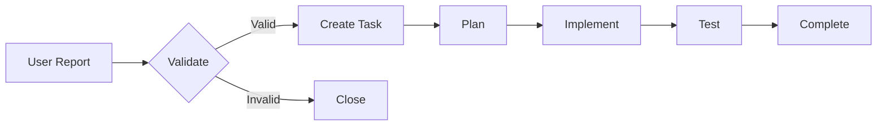

# mcp-server-filesystem - Tasks Index

**Last Updated**: 2025-12-17  
**Sub-Project**: mcp-server-filesystem  
**Status**: Active Maintenance

## Overview

This index tracks all tasks for the mcp-server-filesystem sub-project. The project is feature-complete and in maintenance mode.

## Task Statistics

**Total Tasks**: 0  
**In Progress**: 0  
**Pending**: 0  
**Completed**: All foundational work complete  
**Blocked**: 0  
**Abandoned**: 0

## In Progress

_No tasks currently in progress. Project in maintenance mode._

## Pending

_No pending tasks. New tasks will be added based on user feedback and roadmap._

## Planned (Q1 2025)

_These are not yet formal tasks, but planned enhancements:_

- **Advanced Security Policies**: Fine-grained operation controls
- **Performance Monitoring**: Built-in metrics collection
- **Crates.io Publication**: Prepare and publish to crates.io
- **Configuration Examples**: Expand use case coverage

## Completed

_All v1.0.0-rc.1 features are complete. See `progress.md` for detailed completion status._

### Major Completed Work

- ✅ **Security Framework** - Path validation, binary blocking, approval workflows (Completed 2024-12-08)
- ✅ **File Operations** - Read, write, list, create, delete, move, copy (Completed 2024-12-10)
- ✅ **Configuration System** - Multi-source, environment-aware (Completed 2024-12-12)
- ✅ **CLI Interface** - Setup, config, run commands (Completed 2024-12-13)
- ✅ **Claude Integration** - Seamless integration examples (Completed 2024-12-14)
- ✅ **Documentation** - Comprehensive guides and examples (Completed 2024-12-15)
- ✅ **Testing** - Security and integration test suites (Completed 2024-12-15)

## Abandoned

_No abandoned tasks._

---

## Task Management Guidelines

### When to Create Tasks

1. **Security Issues**: Any discovered security vulnerabilities
2. **User-Reported Bugs**: Confirmed bugs from users
3. **Configuration Improvements**: New use case examples
4. **Performance Issues**: Identified bottlenecks
5. **Feature Requests**: Validated enhancement requests

### Task Workflow

### Task Naming Convention

Format: `task-[ID]-[short-description].md`

Examples:
- `task-001-add-advanced-security-policies.md`
- `task-002-implement-performance-monitoring.md`
- `task-003-expand-configuration-examples.md`

---

**Note**: This sub-project is feature-complete and in maintenance mode. New tasks are created reactively based on user feedback, bug reports, and planned enhancements.
