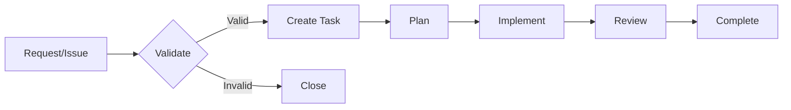

# protocols-mcp - Tasks Index

**Last Updated**: 2025-12-17  
**Sub-Project**: protocols-mcp  
**Status**: Active Maintenance

## Overview

This index tracks all tasks for the protocols-mcp sub-project. The project is in active maintenance mode with focus on stability, documentation, and incremental enhancements.

## Task Statistics

**Total Tasks**: 0  
**In Progress**: 0  
**Pending**: 0  
**Completed**: All foundational work complete  
**Blocked**: 0  
**Abandoned**: 0

## In Progress

_No tasks currently in progress. Project in maintenance mode._

## Pending

_No pending tasks. New tasks will be added based on community feedback and roadmap._

## Planned (Q1 2025)

_These are not yet formal tasks, but planned enhancements:_

- **WebSocket Transport**: Implement WebSocket transport adapter
- **Rate Limiting Middleware**: Add rate limiting for production deployments
- **Crates.io Publication**: Prepare and publish to crates.io
- **Performance Optimization**: Profile and optimize hot paths

## Completed

_All v1.0.0-rc.1 features are complete. See `progress.md` for detailed completion status._

### Major Completed Work

- ✅ **Protocol Implementation** - JSON-RPC 2.0 and MCP types (Completed 2024-12-01)
- ✅ **Transport Layer** - Stdio, HTTP, SSE transports (Completed 2024-12-05)
- ✅ **Authentication** - API Key and OAuth2 strategies (Completed 2024-12-10)
- ✅ **Authorization** - Policy-based middleware (Completed 2024-12-10)
- ✅ **Provider Framework** - Tool/Resource/Prompt providers (Completed 2024-12-12)
- ✅ **Integration APIs** - Server and client builders (Completed 2024-12-14)
- ✅ **Documentation** - mdBook guide and examples (Completed 2024-12-15)
- ✅ **Testing** - Comprehensive test suite (Completed 2024-12-15)

## Abandoned

_No abandoned tasks._

---

## Task Management Guidelines

### When to Create Tasks

1. **New Features**: Significant new functionality (e.g., WebSocket transport)
2. **Bug Fixes**: Confirmed bugs that require investigation
3. **Performance Issues**: Identified performance bottlenecks
4. **Documentation Gaps**: Missing or unclear documentation
5. **Community Requests**: Validated feature requests from users

### Task Workflow

### Task Naming Convention

Format: `task-[ID]-[short-description].md`

Examples:
- `task-001-implement-websocket-transport.md`
- `task-002-add-rate-limiting-middleware.md`
- `task-003-optimize-message-processing.md`

---

**Note**: This sub-project is feature-complete and in maintenance mode. New tasks are created reactively based on community feedback, bug reports, and planned enhancements.
