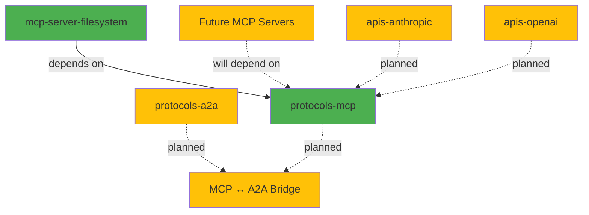
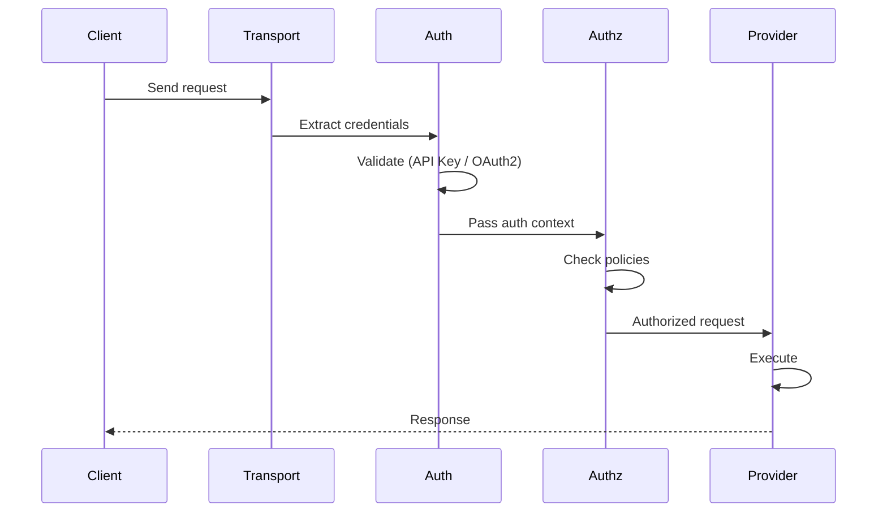

# Workspace Architecture

**Last Updated**: 2025-12-15  
**Version**: 1.0

## Overview

AirsProtocols is a Rust workspace containing protocol implementations and server applications for AI agent communication. The architecture emphasizes modularity, type safety, and clean separation between protocol specification and implementation.

## Workspace Structure

```
airsprotocols/
├── protocols/                  # Protocol implementations (libraries)
│   ├── mcp/                   # Model Context Protocol
│   └── a2a/                   # Agent-to-Agent Protocol (planned)
│
├── mcp/servers/               # MCP server applications
│   └── filesystem/            # Filesystem MCP server
│
├── apis/                      # LLM provider clients (planned)
│   ├── anthropic/
│   ├── openai/
│   └── google/
│
├── docs/                      # Documentation site (MkDocs)
├── site-mkdocs/               # MkDocs configuration
├── .aiassisted/               # AI agent guidelines and instructions
└── .memory-bank/              # Project memory and context
```

## Dependency Graph



**Legend**:
- 🟢 Green: Complete/Active
- 🟡 Yellow: Planned
- Solid lines: Current dependencies
- Dashed lines: Planned dependencies

## Core Components

### 1. protocols-mcp (Library)

**Location**: `protocols/mcp/`  
**Status**: ✅ Complete (v0.2.3)  
**Type**: Library Crate

**Architecture**:

```
protocols-mcp/
├── protocol/           # Core protocol types
│   ├── message.rs     # JSON-RPC messages
│   ├── types.rs       # MCP type definitions
│   └── errors.rs      # Error types
│
├── transport/          # Transport abstractions
│   ├── adapters/
│   │   ├── stdio.rs   # Standard I/O transport
│   │   ├── http.rs    # HTTP transport
│   │   └── sse.rs     # Server-Sent Events
│   └── mod.rs         # Transport trait
│
├── authentication/     # Auth strategies
│   ├── strategies/
│   │   ├── apikey/    # API Key authentication
│   │   └── oauth2/    # OAuth2 authentication
│   └── manager.rs     # Auth manager
│
├── authorization/      # Authorization middleware
│   ├── policy.rs      # Policy definitions
│   └── middleware.rs  # Enforcement logic
│
├── providers/          # Capability providers
│   ├── tool.rs        # Tool provider trait
│   ├── resource.rs    # Resource provider trait
│   └── prompt.rs      # Prompt provider trait
│
├── integration/        # High-level APIs
│   ├── server.rs      # McpServer builder
│   └── client.rs      # McpClient builder
│
└── oauth2/             # OAuth2 lifecycle management
    ├── lifecycle/      # Token management
    ├── middleware/     # HTTP middleware
    └── validator/      # JWT validation
```

**Key Responsibilities**:
- JSON-RPC 2.0 message handling
- MCP protocol type definitions
- Transport abstraction and implementations
- Authentication and authorization frameworks
- Provider trait definitions
- Client and server integration APIs

**Public API Surface**:
- `McpServer`, `McpClient` - High-level builders
- `Transport` trait + implementations
- `ToolProvider`, `ResourceProvider`, `PromptProvider` traits
- Authentication and authorization types
- Protocol types and error types

### 2. mcp-server-filesystem (Application)

**Location**: `mcp/servers/filesystem/`  
**Status**: ✅ Complete  
**Type**: Binary Crate with Library

**Architecture**:

```
mcp-server-filesystem/
├── src/
│   ├── binary/          # Binary entry point
│   │   └── main.rs
│   │
│   ├── cli/             # CLI interface
│   │   ├── commands.rs  # setup, config, run
│   │   └── args.rs      # Argument parsing
│   │
│   ├── config/          # Configuration management
│   │   ├── loader.rs    # Multi-source loading
│   │   ├── env.rs       # Environment detection
│   │   └── validation.rs
│   │
│   ├── filesystem/      # Filesystem operations
│   │   ├── operations.rs
│   │   ├── validation.rs
│   │   └── metadata.rs
│   │
│   ├── mcp/             # MCP integration
│   │   ├── handlers.rs  # Request handlers
│   │   ├── providers.rs # ToolProvider impl
│   │   └── server.rs    # Server setup
│   │
│   └── lib.rs           # Library exports
│
├── examples/            # Configuration examples
│   ├── config/          # Sample configs
│   └── claude-desktop/  # Integration examples
│
├── tests/               # Integration tests
│   ├── security_*.rs    # Security test suite
│   └── phase2_*.rs      # Feature tests
│
└── docs/                # mdBook documentation
    └── src/
```

**Key Responsibilities**:
- Secure filesystem operations
- Path validation and sandboxing
- Human-in-the-loop approval workflows
- Configuration management
- Audit logging
- CLI interface

**Dependencies**:
- `airsprotocols-mcp` - For MCP protocol implementation
- `tokio` - Async runtime
- `clap` - CLI parsing
- `config` - Configuration management
- Security crates (path validation, etc.)

## Cross-Cutting Concerns

### 1. Authentication & Authorization

**Implemented in**: `protocols-mcp`  
**Used by**: All MCP servers

**Flow**:


**Strategies**:
- **API Key**: Simple token-based auth
- **OAuth2**: Full OAuth2 flow with JWT validation

### 2. Configuration Management

**Pattern**: Environment-aware with multiple sources

```
Priority (highest to lowest):
1. Environment variables (e.g., APP_SERVER_PORT)
2. Environment-specific file (e.g., production.toml)
3. Default configuration (default.toml)
```

**Example**:
```toml
# ~/.config/app/development.toml
[security]
strict_validation = false
allowed_paths = ["~/projects/**/*"]

[logging]
level = "debug"
```

### 3. Error Handling Strategy

**Libraries** (`protocols-mcp`):
```rust
use thiserror::Error;

#[derive(Error, Debug)]
pub enum ProtocolError {
    #[error("Transport error: {0}")]
    Transport(#[from] TransportError),
    
    #[error("Authentication failed")]
    AuthenticationFailed,
}
```

**Applications** (`mcp-server-filesystem`):
```rust
use anyhow::{Result, Context};

fn main() -> Result<()> {
    start_server()
        .context("Failed to start filesystem server")?;
    Ok(())
}
```

### 4. Logging Strategy

**Framework**: `tracing` with structured logging

```rust
use tracing::{info, error, event, Level};

event!(
    name: "file.read.success",
    Level::INFO,
    file.path = path.display(),
    file.size = size,
    user_id = user.id,
    "Read {{file.size}} bytes from {{file.path}}"
);
```

**Outputs**:
- Development: Console with colors
- Production: JSON logs to file
- Audit: Separate audit log stream

### 5. Testing Strategy

**Levels**:

1. **Unit Tests** - Per-module tests
   ```rust
   #[test]
   fn test_message_validation() { /* ... */ }
   ```

2. **Integration Tests** - Cross-module tests
   ```rust
   #[tokio::test]
   async fn test_full_request_flow() { /* ... */ }
   ```

3. **Property Tests** - Invariant testing
   ```rust
   proptest! {
       #[test]
       fn test_path_security(path in ".*") { /* ... */ }
   }
   ```

4. **Security Tests** - Threat modeling
   ```rust
   #[tokio::test]
   async fn test_path_traversal_prevention() { /* ... */ }
   ```

## Build & Release

### Development Build

```bash
cargo build --workspace
cargo test --workspace
```

### Release Build

```bash
cargo build --release --workspace
cargo test --release --workspace
```

### Binary Distribution

**Filesystem Server**:
```bash
# Install from crates.io
cargo install airsprotocols-mcpserver-fs

# Or build from source
cargo build --release -p airsprotocols-mcpserver-fs
```

### Documentation

**Protocol Docs**:
```bash
cd protocols/mcp/docs
mdbook serve
```

**Site Docs**:
```bash
cd site-mkdocs
mkdocs serve
```

## Deployment Patterns

### 1. Claude Desktop Integration

```json
{
  "mcpServers": {
    "filesystem": {
      "command": "/usr/local/bin/airsprotocols-mcpserver-fs",
      "env": {
        "AIRSPROTOCOLS_MCPSERVER_FS_ENV": "development"
      }
    }
  }
}
```

### 2. Standalone Server

```bash
airsprotocols-mcpserver-fs \
  --config /etc/airs/filesystem.toml \
  --env production
```

### 3. Docker Container

```dockerfile
FROM rust:1.88 as builder
WORKDIR /app
COPY . .
RUN cargo build --release -p airsprotocols-mcpserver-fs

FROM debian:bookworm-slim
COPY --from=builder /app/target/release/airsprotocols-mcpserver-fs /usr/local/bin/
CMD ["airsprotocols-mcpserver-fs"]
```

## Performance Characteristics

### protocols-mcp

- **Message Processing**: <1ms per message
- **Transport Overhead**: <100μs for stdio, <5ms for HTTP
- **Memory**: <10MB base, scales linearly with connections

### mcp-server-filesystem

- **File Operations**: <100ms for typical files
- **Path Validation**: <1ms per validation
- **Memory**: <50MB base, scales with file sizes

## Security Architecture

### Defense in Depth

```
┌─────────────────────────────┐
│  1. Input Validation        │  ← Validate all inputs
├─────────────────────────────┤
│  2. Authentication          │  ← Verify identity
├─────────────────────────────┤
│  3. Authorization           │  ← Check permissions
├─────────────────────────────┤
│  4. Path Validation         │  ← Prevent traversal
├─────────────────────────────┤
│  5. Operation Approval      │  ← Human confirmation
├─────────────────────────────┤
│  6. Audit Logging           │  ← Track all actions
└─────────────────────────────┘
```

### Threat Model

**Considered Threats**:
- Directory traversal attacks
- Path manipulation (symlinks, Unicode)
- Binary file exploits
- Unauthorized access
- Token theft/replay

**Mitigations**:
- Comprehensive path canonicalization
- Binary file blocking
- Token validation with expiry
- Rate limiting
- Audit trails

## Extensibility Points

### 1. New Transports

Implement `Transport` trait:
```rust
#[async_trait]
impl Transport for MyTransport {
    async fn send(&mut self, msg: JsonRpcMessage) -> Result<()>;
    async fn receive(&mut self) -> Result<JsonRpcMessage>;
}
```

### 2. New MCP Servers

Depend on `protocols-mcp` and implement providers:
```rust
use airsprotocols_mcp::providers::ToolProvider;

struct MyToolProvider;

#[async_trait]
impl ToolProvider for MyToolProvider {
    async fn call_tool(&self, call: ToolCall) -> Result<ToolResult> {
        // Implementation
    }
}
```

### 3. New Auth Strategies

Implement `AuthStrategy` trait:
```rust
#[async_trait]
impl AuthStrategy for MyAuth {
    async fn authenticate(&self, req: &Request) -> Result<AuthContext>;
}
```

## Related Documentation

- **Project Brief**: `project-brief.md`
- **Shared Patterns**: `shared-patterns.md`
- **Progress Tracking**: `workspace-progress.md`

---

This architecture provides a solid foundation for building production-ready AI agent communication systems in Rust.
