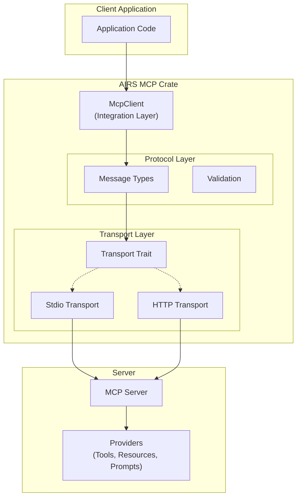

# Architecture

This document provides a high-level overview of the AIRS Protocols workspace architecture, design patterns, and organizational principles.

## Workspace Architecture

AIRS Protocols is organized as a Cargo workspace with a clean separation between different concerns:

```
airsprotocols/
├── protocols/          # Communication protocol implementations
│   ├── mcp/           # Model Context Protocol
│   └── a2a/           # Agent-to-Agent Protocol (Planned)
│
├── apis/              # LLM provider API clients (Planned)
│   ├── anthropic/     # Claude API client
│   ├── openai/        # GPT API client
│   ├── google/        # Gemini API client
│   └── ollama/        # Ollama client
│
└── Cargo.toml         # Workspace configuration
```

### Workspace Benefits

- **Shared Dependencies**: Common dependencies managed at workspace level
- **Consistent Standards**: Unified linting, formatting, and testing
- **Cross-Package Integration**: Easy integration between protocols and APIs
- **Independent Versioning**: Each package maintains its own version
- **Optimized Builds**: Cargo optimizes builds across the workspace

## Dependency Layers

The workspace organizes dependencies in conceptual layers to maintain clean architecture:

### Layer 1: AIRS Protocols Crates
- Internal workspace crates
- `airsprotocols-mcp`, `airsprotocols-a2a`, etc.

### Layer 2: Core Runtime
- `tokio` - Async runtime
- `tokio-stream` - Async stream utilities
- `futures` - Future and async traits

### Layer 3: Serialization & Data
- `serde` - Serialization framework
- `serde_json` - JSON support
- `serde_urlencoded` - URL encoding

### Layer 4: Async & Concurrency
- `dashmap` - Concurrent hash map
- `async-trait` - Async trait support

### Layer 5: Error Handling
- `thiserror` - Error derive macros

### Layer 6: Utilities
- `uuid` - Unique identifiers
- `bytes` - Byte manipulation
- `chrono` - Date and time
- `tracing` - Logging framework

### Layer 7: HTTP & Networking
- `axum` - Web framework
- `hyper` - HTTP library
- `tower` - Service middleware
- `reqwest` - HTTP client

### Layer 8: Authentication & Security
- `jsonwebtoken` - JWT handling
- `oauth2` - OAuth2 client
- `base64` - Base64 encoding

## Design Patterns

### Protocol Implementation Pattern

All protocol implementations follow a consistent architecture:

```
┌─────────────────────────────────────┐
│     Integration Layer               │
│  (High-level Client/Server APIs)    │
└─────────────────────────────────────┘
                 ↓
┌─────────────────────────────────────┐
│     Provider Layer                  │
│  (Capability Implementations)       │
└─────────────────────────────────────┘
                 ↓
┌─────────────────────────────────────┐
│     Protocol Layer                  │
│  (Message Types & Validation)       │
└─────────────────────────────────────┘
                 ↓
┌─────────────────────────────────────┐
│     Transport Layer                 │
│  (Communication Abstractions)       │
└─────────────────────────────────────┘
```

#### Integration Layer
- High-level APIs (e.g., `McpClient`, `McpServer`)
- Builder patterns for configuration
- Lifecycle management
- User-facing interfaces

#### Provider Layer
- Trait-based capability interfaces
- Tool, Resource, and Prompt providers
- Extensible implementation model
- Business logic integration points

#### Protocol Layer
- Message type definitions
- Protocol validation
- Spec compliance
- Error types

#### Transport Layer
- Transport abstraction trait
- Concrete implementations (stdio, HTTP, WebSocket)
- Connection management
- Low-level communication

### Builder Pattern

All major components use the builder pattern for construction:

```rust
let client = McpClientBuilder::new()
    .client_info("my-app", "1.0.0")
    .timeout(Duration::from_secs(30))
    .capabilities(capabilities)
    .build(transport)
    .await?;
```

Benefits:
- Clear, self-documenting API
- Optional parameters with defaults
- Compile-time validation
- Ergonomic configuration

### Trait-Based Extensibility

Protocols define core traits that users implement:

```rust
#[async_trait]
pub trait ToolProvider: Send + Sync {
    async fn list_tools(&self) -> Result<Vec<Tool>, Error>;
    async fn call_tool(&self, call: ToolCall) -> Result<ToolResult, Error>;
}
```

Benefits:
- Clean separation of concerns
- Easy testing with mocks
- Flexible implementation strategies
- Protocol evolution without breaking changes

### Type-Safe Error Handling

All operations return `Result<T, E>` with specific error types:

```rust
pub enum IntegrationError {
    ConnectionFailed(String),
    ProtocolError(String),
    MethodNotFound(String),
    // ...
}
```

Benefits:
- Explicit error handling
- Rich error context
- Type-safe error propagation
- Clear error recovery paths

## MCP Architecture

The Model Context Protocol implementation demonstrates the architectural patterns:



For detailed MCP architecture, see [MCP Architecture](protocols/mcp/architecture/core.md).

## Async Architecture

All AIRS Protocols are built on async/await with tokio:

### Async Principles

1. **Non-Blocking I/O**: All I/O operations are async
2. **Concurrent Execution**: Multiple operations can run concurrently
3. **Efficient Resources**: Minimal memory and CPU overhead
4. **Scalability**: Handle thousands of concurrent connections

### Async Patterns

```rust
// Async trait methods
#[async_trait]
pub trait Transport: Send + Sync {
    async fn send(&self, message: JsonRpcMessage) -> Result<JsonRpcMessage, Error>;
}

// Async client operations
let tools = client.list_tools().await?;
let result = client.call_tool(tool_call).await?;
```

## Testing Architecture

### Testing Layers

1. **Unit Tests**: Test individual components in isolation
2. **Integration Tests**: Test component interactions
3. **Property-Based Tests**: Test invariants with random inputs
4. **Benchmark Tests**: Measure performance characteristics

### Testing Tools

- **proptest**: Property-based testing for edge cases
- **criterion**: Performance benchmarking
- **tokio-test**: Async testing utilities
- **wiremock**: HTTP mocking for integration tests

## Security Architecture

### Authentication Layer

- Pluggable authentication strategies
- API Key authentication
- OAuth2 with PKCE support
- Bearer token authentication

### Authorization Layer

- Policy-based authorization
- Scope validation
- Resource-level access control
- Audit logging

### Transport Security

- HTTPS for HTTP transport
- Token validation
- Request signing
- Rate limiting support

## Performance Considerations

### Zero-Cost Abstractions

- Trait objects only where necessary
- Generic types for compile-time optimization
- Inline critical paths
- Minimal allocations

### Connection Pooling

- Reusable connection pools
- Connection lifecycle management
- Backpressure handling
- Graceful degradation

### Async Efficiency

- Tokio task spawning for concurrency
- Stream-based processing
- Buffered I/O
- Selective polling

## Future Architecture

### Planned Extensions

1. **Bridge Adapters**: Protocol translation between MCP and A2A
2. **Unified LLM Interface**: Common API across providers
3. **Plugin System**: Dynamic capability loading
4. **Distributed Tracing**: OpenTelemetry integration

### Extensibility Points

- Custom transport implementations
- Additional authentication strategies
- Protocol extensions
- Custom provider types

## Development Guidelines

### Code Organization

- **One concept per module**: Clear module boundaries
- **Public API minimization**: Expose only what's necessary
- **Documentation first**: Document before implementing
- **Test-driven development**: Write tests alongside code

### API Design

- **Builder pattern**: For complex construction
- **Trait-based**: For extensibility
- **Result types**: For error handling
- **Async-first**: All I/O is async

### Performance

- **Measure first**: Profile before optimizing
- **Avoid allocations**: Reuse buffers where possible
- **Benchmark regressions**: Automated performance testing
- **Document complexity**: Big-O analysis for algorithms

## References

### Internal Documentation

- [MCP Architecture](protocols/mcp/architecture/core.md)
- [MCP Data Flow](protocols/mcp/architecture/data-flow.md)
- [Getting Started](getting-started.md)

### External Resources

- [Model Context Protocol Specification](https://modelcontextprotocol.io/)
- [Tokio Documentation](https://tokio.rs/)
- [Rust Async Book](https://rust-lang.github.io/async-book/)

---

Continue to [MCP Documentation](protocols/mcp/index.md) for protocol-specific architecture details.
