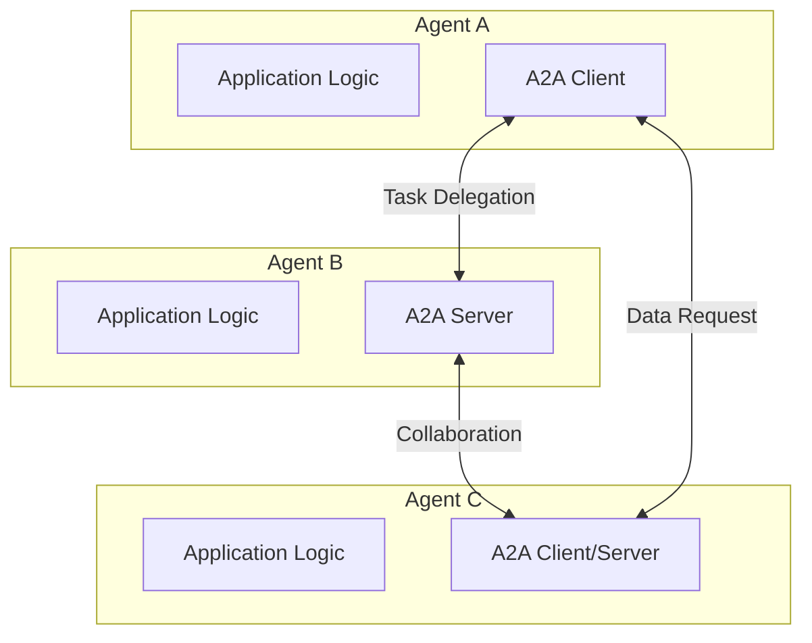

# Agent-to-Agent Protocol (A2A)

<span class="version-badge">Planned</span>

!!! info "Status: In Development"
    The Agent-to-Agent Protocol implementation is currently in the planning and design phase. This page outlines the planned features and roadmap.

## Overview

The Agent-to-Agent Protocol (A2A), formerly known as the Agent Communication Protocol (ACP), is a standardized communication protocol that enables independent AI agents to interact, collaborate, and coordinate with each other.

A2A provides a foundation for building multi-agent systems where agents can:

- Discover and connect with other agents
- Exchange messages and data
- Delegate tasks and coordinate workflows
- Stream real-time updates
- Maintain conversation context

## Vision

As AI systems evolve, the need for multiple specialized agents to work together becomes critical. A2A aims to be the standard protocol for agent collaboration, enabling:

- **Horizontal Scaling**: Multiple agents handling different aspects of complex tasks
- **Specialization**: Each agent focused on specific domains or capabilities
- **Resilience**: Fault-tolerant systems with agent redundancy
- **Interoperability**: Agents from different vendors working together

## Planned Features

### Core Protocol

- **Message Passing**: Standardized message formats for agent communication
- **Task Management**: Task creation, delegation, and lifecycle tracking
- **Capability Discovery**: Agents can query and advertise their capabilities
- **Context Management**: Maintain conversation and task context across agents
- **Error Handling**: Comprehensive error types and recovery mechanisms

### Transport Bindings

Multiple protocol bindings for different use cases:

- **JSON-RPC 2.0**: Lightweight RPC for simple scenarios
- **gRPC**: High-performance binary protocol
- **REST**: HTTP-based for web integrations
- **WebSocket**: Real-time bidirectional communication

### Authentication & Authorization

- **Agent Identity**: Cryptographic agent identification
- **Trust Models**: Configurable trust levels between agents
- **Permission System**: Fine-grained authorization for operations
- **Audit Logging**: Comprehensive tracking of agent interactions

### Advanced Features

- **Streaming**: Real-time data streaming between agents
- **Pub/Sub**: Event-driven agent coordination
- **Routing**: Intelligent message routing in agent networks
- **Load Balancing**: Distribute work across agent pools

## Architecture (Planned)



## Use Cases

### 1. Multi-Agent Task Decomposition

Break complex tasks into subtasks handled by specialized agents:

- Research agent gathers information
- Analysis agent processes data
- Writing agent generates content
- Review agent validates output

### 2. Agent Collaboration

Multiple agents working together on shared goals:

- Code generation agent creates implementation
- Testing agent validates functionality
- Documentation agent writes guides
- Deployment agent handles release

### 3. Agent Orchestration

Coordinator agent managing a team of worker agents:

- Load balancing across agents
- Task prioritization and scheduling
- Resource allocation
- Result aggregation

### 4. Agent Networks

Distributed networks of agents:

- Service mesh of specialized agents
- Dynamic agent discovery
- Fault-tolerant communication
- Scalable architecture

## Roadmap

### Phase 1: Specification & Design (Q1 2025)

- [ ] Protocol specification review
- [ ] Architecture design
- [ ] API design
- [ ] Security model definition
- [ ] Transport binding selection

### Phase 2: Core Implementation (Q2 2025)

- [ ] Message types and validation
- [ ] JSON-RPC transport binding
- [ ] Basic client/server implementation
- [ ] Task management system
- [ ] Capability discovery

### Phase 3: Advanced Features (Q3 2025)

- [ ] gRPC transport binding
- [ ] Authentication system
- [ ] Streaming support
- [ ] Routing and discovery
- [ ] Comprehensive testing

### Phase 4: Ecosystem (Q4 2025)

- [ ] Documentation and examples
- [ ] Integration with MCP
- [ ] Bridge adapters
- [ ] Performance optimization
- [ ] Production hardening

## Technical Specifications (Draft)

### Message Format

```rust
pub struct A2AMessage {
    pub id: MessageId,
    pub from: AgentId,
    pub to: AgentId,
    pub message_type: MessageType,
    pub payload: serde_json::Value,
    pub timestamp: DateTime<Utc>,
}

pub enum MessageType {
    TaskRequest,
    TaskResponse,
    TaskStatus,
    DataQuery,
    DataResponse,
    CapabilityQuery,
    CapabilityResponse,
}
```

### Agent Interface

```rust
#[async_trait]
pub trait Agent: Send + Sync {
    async fn handle_task(&self, task: Task) -> Result<TaskResult, Error>;
    async fn query_data(&self, query: DataQuery) -> Result<DataResponse, Error>;
    async fn capabilities(&self) -> Vec<Capability>;
    async fn status(&self) -> AgentStatus;
}
```

### Task Lifecycle

```rust
pub enum TaskStatus {
    Pending,
    Accepted,
    InProgress,
    Completed,
    Failed,
    Cancelled,
}

pub struct Task {
    pub id: TaskId,
    pub description: String,
    pub parameters: serde_json::Value,
    pub status: TaskStatus,
    pub created_at: DateTime<Utc>,
}
```

## Integration with MCP

A2A and MCP are complementary protocols:

- **MCP**: Connect AI models to tools and resources
- **A2A**: Enable communication between AI agents

Planned integration:

- **MCP-to-A2A Bridge**: Expose A2A agents as MCP tools
- **A2A-to-MCP Adapter**: Allow A2A agents to use MCP servers
- **Unified Client**: Single client supporting both protocols

## Contributing

We're actively seeking community input on the A2A design!

### How to Contribute

1. **Design Discussions**: Share ideas in [GitHub Discussions](https://github.com/airsstack/airsprotocols/discussions)
2. **Specification Review**: Comment on the protocol specification
3. **Use Case Input**: Share your multi-agent use cases
4. **Early Testing**: Join the early adopter program (coming soon)

### Areas of Interest

- Protocol design and message formats
- Transport binding selection
- Authentication and security models
- Agent discovery mechanisms
- Task management patterns

## Resources

### External Resources

- [Agent-to-Agent Protocol Specification](https://a2a-protocol.org/)
- [Linux Foundation Project](https://www.linuxfoundation.org/)
- [Multi-Agent Systems Research](https://en.wikipedia.org/wiki/Multi-agent_system)

### Related Documentation

- [AIRS Protocols Overview](../index.md)
- [MCP Documentation](../mcp/index.md)
- [Architecture Guide](../../architecture.md)

## Stay Updated

Follow development progress:

- **GitHub**: Watch the [repository](https://github.com/airsstack/airsprotocols) for updates
- **Discussions**: Join [GitHub Discussions](https://github.com/airsstack/airsprotocols/discussions)
- **Issues**: Track [A2A-related issues](https://github.com/airsstack/airsprotocols/issues?q=label%3Aa2a)

---

Interested in A2A? Star the repository and watch for updates! We'll announce when the implementation begins.
